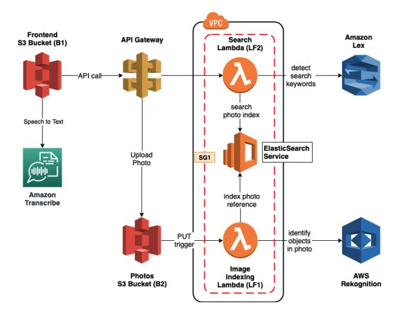
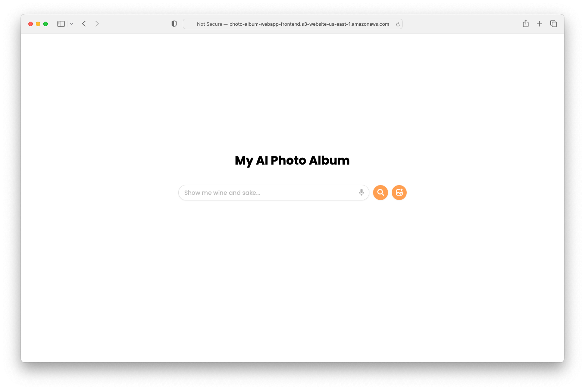
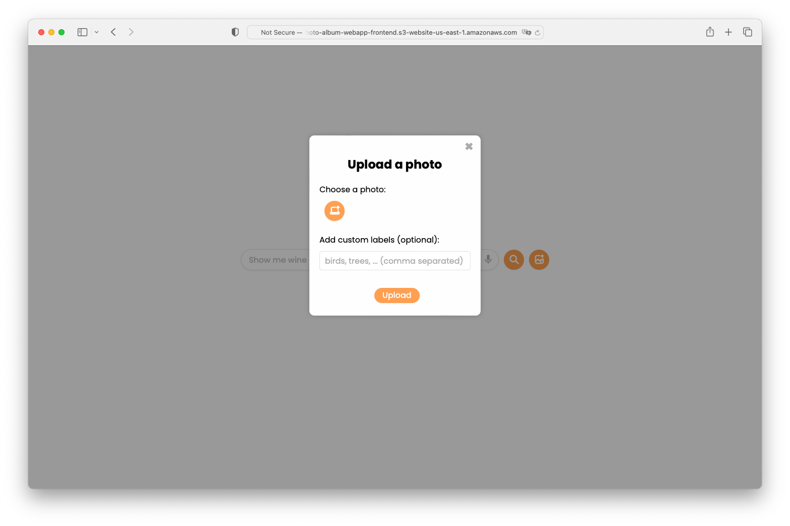
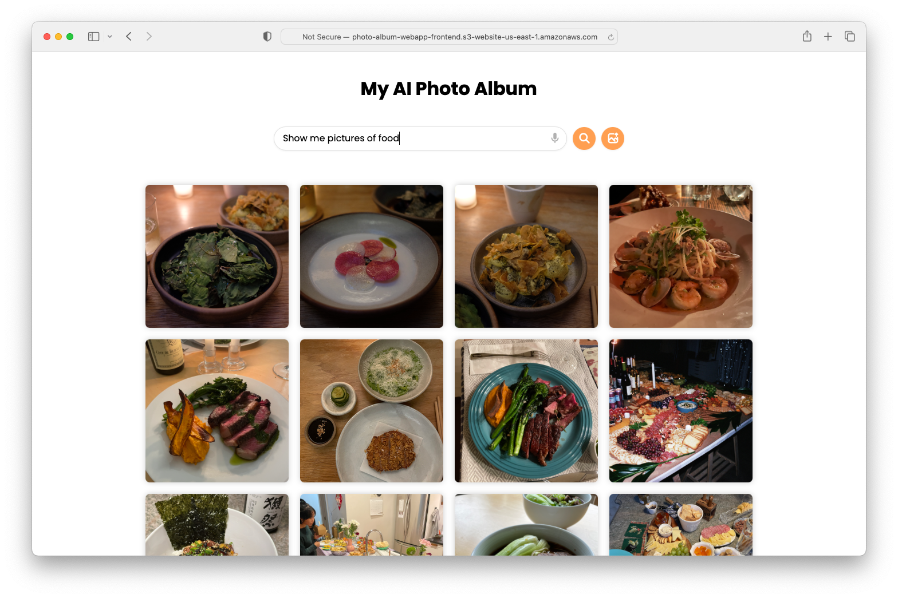
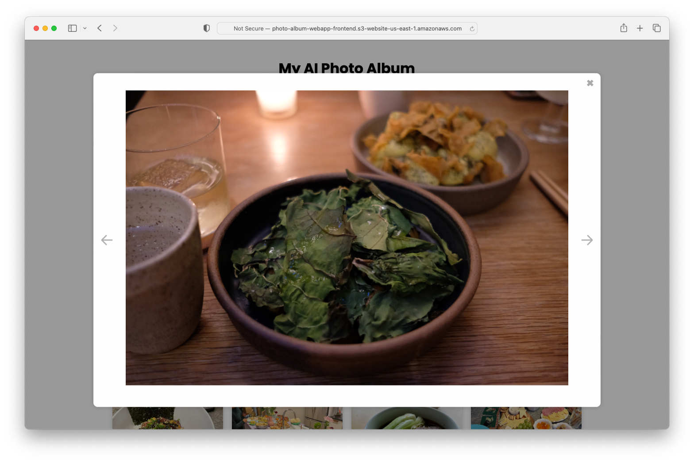
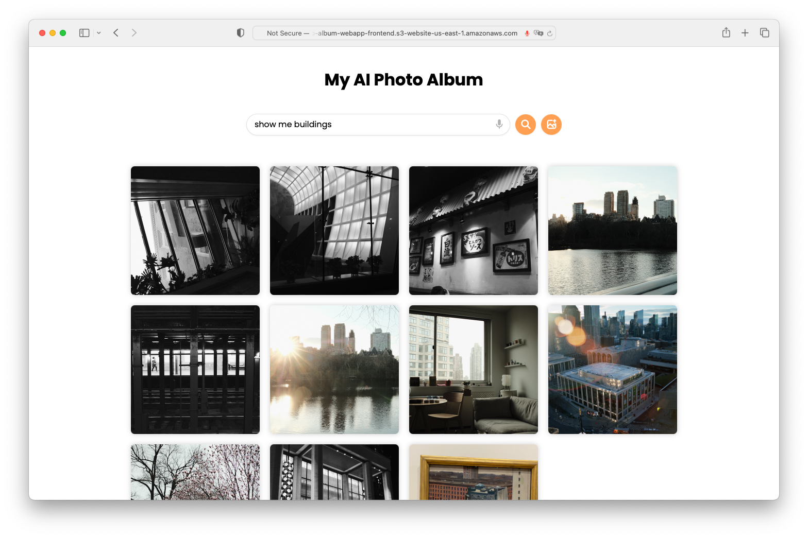
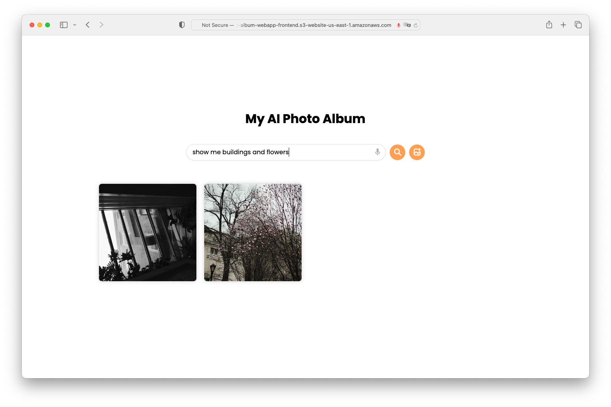

  <h1>AI Photo Album Web App (AWS)</h1>
<!--   

    <a
      href="http://photo-album-webapp-frontend.s3-website-us-east-1.amazonaws.com"
      target="_new"
      ><strong>Visit the Live Demo</strong></a
    >
  
 -->
  

    This web application allows users to upload images, apply custom labels, and search
    for images based on labels. It is built using HTML, CSS, JavaScript, AWS Rekognition,
    AWS Lex, API Gateway, AWS Lambda, Amazon S3, and Amazon OpenSearch Service.
  

  <h2>Features</h2>
  <ul>
    <li>Upload images with custom labels</li>
    <li>Automatically detect image labels using AWS Rekognition</li>
    <li>Search for images using natural language processing (NLP) with AWS Lex</li>
    <li>Serverless backend utilizing API Gateway and AWS Lambda</li>
    <li>Images stored in Amazon S3</li>
    <li>Perform search using Amazon OpenSearch Service</li>
    <li>Image modal for larger previews and navigation between images</li>
  </ul>
  <h2>AWS Services</h2>
  <ul>
    <li>Rekognition</li>
    <li>Lex</li>
    <li>API Gateway</li>
    <li>Lambda</li>
    <li>S3</li>
    <li>OpenSearch Service</li>
    <li>CodePipeline</li>
    <li>CloudFormation</li>
  </ul>
  <h2>Architecture</h2>
  

    
  

  <h2>Screenshots</h2>
  

    
  

  

    
  

  

    
  

  

    
  

  

    
  

  

    
  

